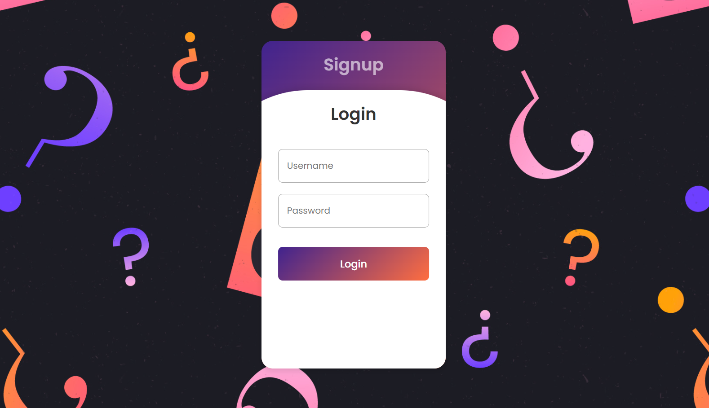
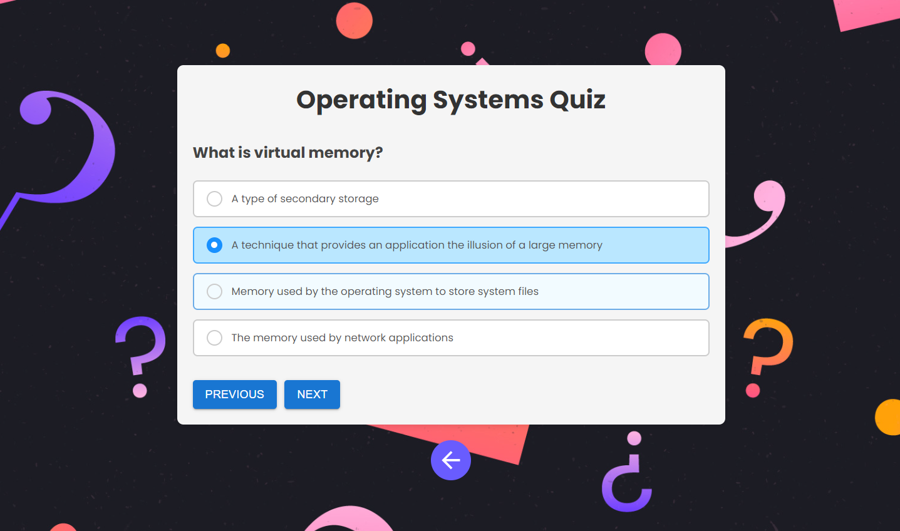
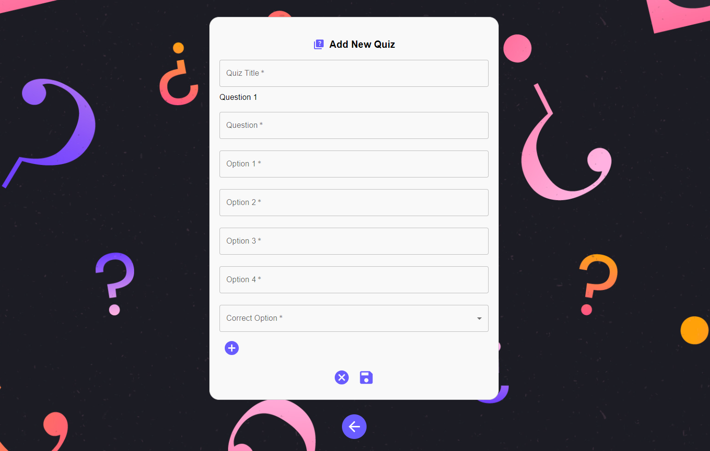

# 🎓 Online Quiz Portal

## 🌟 Project Description

This is our project for the hackathon **Innovate With Ballerina 2024** organized by `WSO2` and `IEEE Student Branch of University of Moratuwa`. 

The **Online Quiz Portal** is a full-stack web application designed to allow users to take quizzes and view their results. The platform supports user registration, login, and separate privileges for users and administrators. Administrators can create quizzes, while users can attempt quizzes and review their scores.

---

## 🚀 Features

- **User Authentication**:
  - 🔒 Register and login using username and password.
  - 🛠️ Admin privileges for managing quizzes.

- **Quiz Management**:
  - 📋 Admins can create quizzes with multiple-choice questions.
  - 🎯 Users can take quizzes and view their scores.

- **Score Management**:
  - 📈 Users can view their past quiz performance and track progress.

---

## 🛠️ Technologies Used

<p>
  <a href="https://skillicons.dev">
    
  </a>
</p>

- **Frontend**: React.js
- **Backend**: Ballerina
- **Database**: MySQL for storing user data, quizzes, questions, and scores
- **Authentication**: 🔑 JWT (JSON Web Tokens) for secure authentication

---

## ⚡ Getting Started

### Frontend Setup

1. Navigate to the `frontend` directory:

   ```bash
   cd frontend
   ```
2. Install the dependencies:

   ```bash
   npm install
   ```
3. Start the development server:

   ```bash
    npm start
    ```
4. Open [http://localhost:3000](http://localhost:3000) in your browser.

### Backend Setup

1. Install Ballerina:

      Download the Ballerina installer from the [official website](https://ballerina.io/downloads/).
    
2. Navigate to the `backend` directory:

   ```bash
   cd backend
   ```
3. Start the Ballerina service:

   ```bash
   bal run
   ```

### Database Setup

1. Install MySQL:

      Download the MySQL installer from the [official website](https://dev.mysql.com/downloads/).

2. Set up the database:

      Run the SQL script to in the `db-setup` directory to create the database and tables.

3. Update the database configuration:

      Create  `Config.toml` file in the `root` directory and add the following configuration:

      ```toml
      # Configuration file for "backend"

      [databaseConfig]	# Type of OBJECT
      database = "db_name"
      user = "root"
      password = "your_password"
      host = "localhost"
      port = 3306
      ```
---

## 📝 Test Data

- **Admin Credentials**:
  - **Username**: admin1
  - **Password**: admin123

- **User Credentials**:
   - **Username**: user1
   - **Password**: user123
---

## 👩‍💻 How to Contribute

1. Fork the repository

   ```bash
   git clone https://github.com/SurajaHasarinda/Online-Quiz-Portal.git
   ```

2. Clone the repository to your local machine

   ```bash
   git clone
    ```
3. Create a new branch for your changes

   ```bash
   git checkout -b feature/branch-name
   ```
4. Make your changes and commit them

   ```bash
    git commit -m 'commit message'
    ```
5. Push your changes to the branch

   ```bash
   git push origin feature/branch-name
   ```  
6. Create a pull request
---

## 👨🏻‍💻 Team Members (Mora_ByteSquad 🦈)

- [Rashmika Rathnayaka](https://github.com/rashG1)
- [Suraja Hasarinda](https://github.com/SurajaHasarinda)
- [Nuwantha Ranaweera](https://github.com/nuwaran)
---

## 📸 Screenshots





